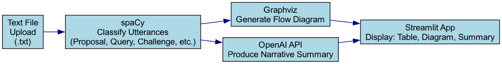

# Dialogue Analysis App

## Overview

The **Dialogue Analysis App** is a Streamlit-based web application that processes, classifies, and visualizes dialogue from uploaded text files. It uses spaCy to classify utterances (e.g., Proposal, Query, Challenge), generates a flow diagram with Graphviz, and produces a concise narrative summary via the OpenAI API.

## Features

- **Upload Dialogue**: Upload a `.txt` file containing dialogue (format: "Speaker: Utterance").
- **Classify Utterances**: Labels each line as Proposal, Query, Challenge, Justification, Deferral, Commitment, or Other, with confidence scores.
- **Visualize Flow**: Displays a dialogue flow diagram using Graphviz.
- **Summarize Conversation**: Generates a concise narrative summary using OpenAI's `gpt-4o-mini` model.
- **Interactive UI**: Toggle confidence scores and diagram visibility, view results in a table.



## Requirements

- **Python**: 3.8 or higher
- **Dependencies**: Listed in `requirements.txt`:
  - streamlit==1.45.1
  - spacy==3.8.7
  - pandas==2.2.2
  - graphviz==0.20.3
  - openai==1.82.0
  - python-dotenv==1.1.0
  - torch==2.7.0

## Installation

1. **Clone the Repository**:
   ```bash
   git clone https://github.com/Nathan-Azuponga/robert-gordon-assessment.git
   cd dialogue-analysis-app
   ```
2. **Set Up a Virtual Environment** (recommended):
   ```bash
   python -m venv <your virtual environment>
   source <your virtual environment>/bin/activate  # macOS/Linux
   .\<your virtual environment>\Scripts\activate   # Windows
   ```
3. **Install Dependencies**:
   ```bash
   pip install -r requirements.txt
   ```
4. **Download spaCy Model**:
   ```bash
   python -m spacy download en_core_web_sm
   ```
5. **Set Up OpenAI API Key**:
   - Create a `.env` file in the project root.
   - Add your OpenAI API key:
     ```
     OPENAI_API_KEY=your-api-key-here
     ```
   - Get your key from [platform.openai.com](https://platform.openai.com).

## Usage

1. **Run the App**:
   ```bash
   streamlit run your_script_name.py
   ```
2. **Interact with the App**:
   - Open your browser (usually at `http://localhost:8501`).
   - Upload a `.txt` file with dialogue (e.g., "Sam: I think we should integrate the chatbot.").
   - Click "Classify" to process and label utterances.
   - Toggle "Show/Hide Confidence Score" to view confidence values.
   - Click "Show Dialogue Flow" to see a visual diagram.
   - Click "Summarize" for a concise narrative summary.
